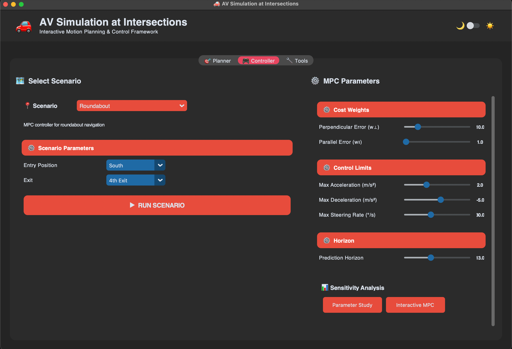
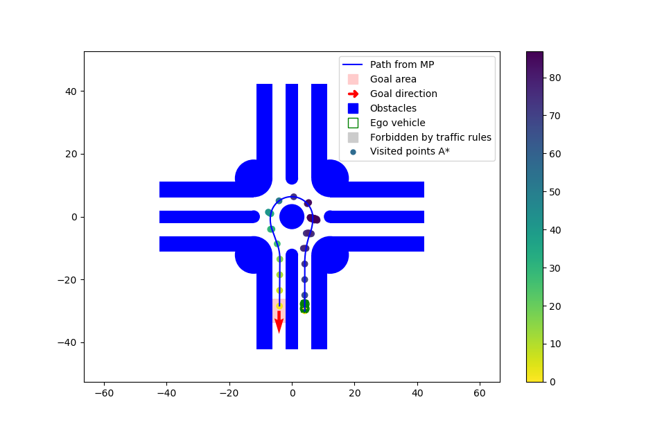

# JunctionSim: A Bi-level Framework for Modeling 2D Vehicular Maneuvers and Interactions at Urban Junctions

This project is a comprehensive collection of scripts and modules related to motion primitives and A* search algorithms. It provides a robust framework for creating and visualizing motion primitives for different vehicle models, and includes a variety of scenarios and environments for testing and development.

## Installation

### Prerequisites
- **Python 3.8 - 3.11** (Python 3.12+ is NOT supported due to dataclass compatibility issues)
- pip (Python package manager)
- ffmpeg (for animation export, optional)

### Step 1: Clone the repository
```bash
git clone https://github.com/SaeedRahmani/AV-Simulation-at-Intersections.git
cd AV-Simulation-at-Intersections
```

### Step 2: Create a virtual environment and install dependencies

Choose **one** of the following options:

---

#### Option A: Using uv (fastest - recommended)

[uv](https://docs.astral.sh/uv/) is an extremely fast Python package installer.

```bash
# Install uv if not already installed
curl -LsSf https://astral.sh/uv/install.sh | sh

# Create virtual environment with Python 3.10
uv venv --python 3.10 .venv

# Activate the virtual environment
# On macOS/Linux:
source .venv/bin/activate

# On Windows:
# .venv\Scripts\activate

# Install dependencies
uv pip install -r requirements.txt
```

---

#### Option B: Using conda

```bash
# Create conda environment with Python 3.10
conda create -n av-sim python=3.10 -y

# Activate the environment
conda activate av-sim

# Install dependencies
pip install -r requirements.txt
```

---

#### Option C: Using venv (standard Python)

```bash
# Create virtual environment (ensure you use Python 3.8-3.11)
python3.10 -m venv .venv

# Activate the virtual environment
# On macOS/Linux:
source .venv/bin/activate

# On Windows:
# .venv\Scripts\activate

# Upgrade pip and install dependencies
pip install --upgrade pip
pip install -r requirements.txt
```

---

### Step 3: Install optional dependencies (if needed)

**For Prius motion primitives generation:**
```bash
pip install gym==0.21.0 urdfenvs
```

**For animation export:**
```bash
# macOS
brew install ffmpeg

# Ubuntu/Debian
sudo apt-get install ffmpeg

# Windows: Download from https://ffmpeg.org/download.html
```

### Verify Installation

Run a quick test to ensure everything is set up correctly:
```bash
cd main/scenarios
python mpc_intersection.py
```

You should see a simulation window with an intersection scenario.

## Quick Start - Interactive Interface

### GUI Application (Recommended)

Launch the modern graphical interface:

```bash
cd main
python app.py
```

<p align="center">
  
</p>

This opens a sleek desktop application with:
- 🎯 **Planner** tab - Motion primitive search algorithms
- 🎮 **Controller** tab - MPC-based trajectory tracking scenarios
- 🔧 **Tools** tab - Motion primitive generation & utilities
- 🌙 Dark/Light mode toggle
- Live output windows for each script

Running a scenario produces real-time simulation output:

<p align="center">
  
</p>

### Command-Line Interface

For terminal users, there's also a CLI:

```bash
cd main
python run.py
```

Both interfaces auto-install missing dependencies.

## Running a Simulation

### Intersection Simulation with Dynamic Obstacles
```bash
cd main/scenarios
python mpc_intersection.py
```

### Other Available Scenarios
```bash
# Roundabout scenario
python mpc_roundabout.py

# Multi-lane intersection
python mpc_intersection_multi_lane.py

# Sensitivity analysis
python mpc_sensitivity_analysis.py
```

## Configuration

The MPC parameters can be configured via JSON files in `main/config/`:
- `mpc_config.json` - Main MPC configuration
- `mpc_config_sensitivity.json` - Working copy for sensitivity analysis (modified during analysis runs)

## Project Structure

- `main/`: This directory contains the core scripts and modules of the project.
    - `create_motion_primitives_bicycle_model.py`: This script generates motion primitives for a bicycle model.
    - `create_motion_primitives_prius.py`: This script generates motion primitives for a Prius model.
    - `envs/`: This directory contains scripts for various environments in which the motion primitives can be tested.
    - `lib/`: This directory contains library scripts, including implementations of the A* search algorithm and scripts for searching motion primitives.
    - `scenarios/`: This directory contains scripts for different scenarios, providing a variety of contexts in which to test the motion primitives.
    - `tests/`: This directory contains unit tests for the project, ensuring the reliability and correctness of the code.
- `data/`: This directory contains data related to the motion primitives, providing a resource for further analysis and development.
- `results/`: This directory is where results from tests and simulations are stored.
- `visualise_mp.ipynb`: This Jupyter notebook provides a visual interface for inspecting the motion primitives.

